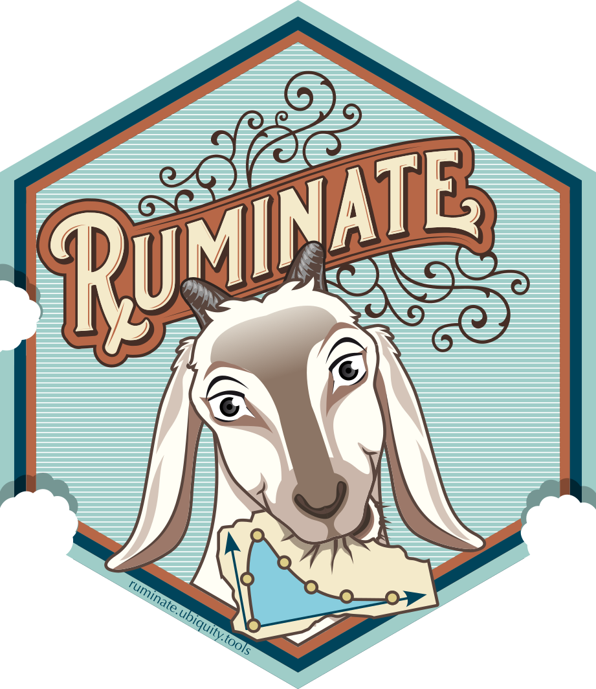

<!-- README.md is generated from README.Rmd. Please edit that file -->

# ruminate 

<!-- 
-->
<!-- badges: start -->

[](https://app.codecov.io/gh/john-harrold/ruminate?branch=master)


[](https://lifecycle.r-lib.org/articles/stages.html)
[](https://github.com/john-harrold/ruminate/actions/workflows/R-CMD-check.yaml)

<!-- badges: end -->

The goal of `{ruminate}` is to facilitate exploration of pharmacometrics
data. This is done by creating a Shiny interface to different tools for
data transformation (`{dplyr}` and `{tidyr}`), plotting (`{ggplot2}`),
and noncompartmental analysis (`{PKNCA}`). These results can be reported
in Excel, Word or PowerPoint. The state of the app can be saved and
loaded at a later date. When saved, a script is generated to reproduce
the different actions in the Shiny interface.

# Deployed example in the cloud

You can point your web browser to
[runrumiate.ubiquity.tools](https://runruminate.ubiquity.tools) and try
the development version of ruminate. Keep in mind this is a public
server. No data is tracked or kept, but it is open to the public. So be
careful about uploading confidential data. Also know this is a single
instance and if many people are using it at once it can be slow.

# Local installation

## From CRAN

You can install the released version of `rumiante` from
[CRAN](https://cran.r-project.org/package=ruminate) with:

``` r
# General dependencies:
install.packages("clipr")
install.packages("gridExtra")
install.packages("prompter")
install.packages("readxl")
install.packages("shinydashboard")
install.packages("ubiquity")

# Dependencies for the MB and CTS modules
install.packages("nlmixr2lib")
install.packages("nonmem2rx")
install.packages("rxode2")

# Actual package
install.packages("ruminate")
```

## Development version

You can install the development version from
[GitHub](https://github.com/john-harrold/ruminate/) with the following:

``` r
# Installing devtools if it's not already installed
if(system.file(package="devtools") == ""){
  install.packages("devtools") 
}

# General dependencies:
install.packages("clipr")
install.packages("gridExtra")
install.packages("prompter")
install.packages("readxl")
install.packages("shinydashboard")
install.packages("ubiquity")

# Dependencies for the MB and CTS modules
install.packages("nlmixr2lib")
install.packages("nonmem2rx")
install.packages("rxode2")

devtools::install_github("john-harrold/onbrand",  dependencies=TRUE)
devtools::install_github("john-harrold/formods",  dependencies=TRUE)
devtools::install_github("john-harrold/ruminate")
```

Note that because `{ruminate}` depends on `{formods}` and `{onbrand}`
you will need to first install the development versions of `{onbrand}`
and `{formods}`.

# Running in ruminate

## In RStudio

This will run the default/stable version of rumiante:

``` r
library(ruminate)
ruminate()
```

As new modules are developed they can be found in the development app.
This command will run the ruminate with any development modules enabled:

``` r
library(ruminate)
library(shiny)
runApp(system.file(package="ruminate","templates", "ruminate_devel.R"))
```

**If you are running this you should probably be using the development
version off of github to make sure you have the latest version.**

## In a Docker container

Note this uses an `x86` image. So it will only work on Intel or AMD
cpus. This means that you wont get very far with an M1 mac. If you want,
you can download the Docker file
[here](https://raw.githubusercontent.com/john-harrold/ruminate/main/inst/docker/local_container).
This will build the docker image from the repository on GitHub.

``` bash
docker build -t ruminate --no-cache  https://raw.githubusercontent.com/john-harrold/ruminate/main/inst/docker/local_container
```

This will run the Docker image locally:

``` bash
docker run --name ruminate --rm -p 3838:3838 ruminate
```

If everything worked you can then point your web browser to:

    http://127.0.0.1:3838/

This will push the image to DockerHub:

``` bash
docker tag ruminate <username>/ruminate:latest
docker push <username>/ruminate:latest
```

You can use this to pull the image from DockerHub:

``` bash
docker pull <username>/ruminate:latest
```

## Deployment and Customization

If you want to deploy and customize ruminate, please see the [Deployment
vignette](https://ruminate.ubiquity.tools/articles/deployment.html).
